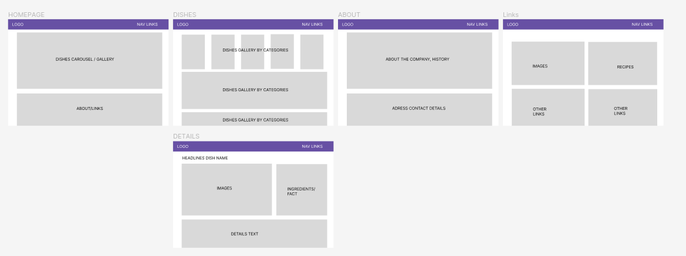
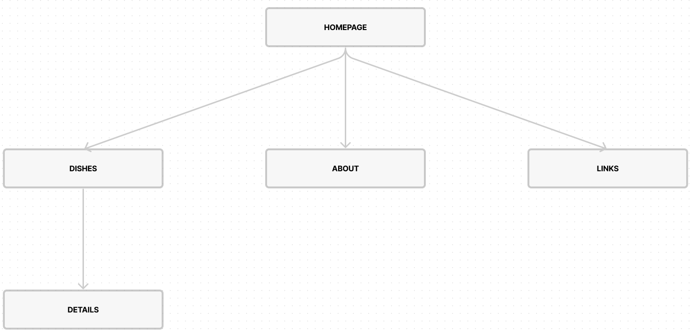

# Food Ninja

## ABOUT

[link to website](https://cirvianum-daw.github.io/mp9-uf1-projectetailwind-gsingh704/src/)
I have created a webiste called Food Ninja. It is a website that allows users to view selected Indian recipes. The website is built using HTML, Tailwind CSS.

## WIREFRAME

[Figma Wireframe Link](https://www.figma.com/file/4avtqszTlJ6dckyqnN66TA/UF1_wireframe?type=design&node-id=0%3A1&mode=design&t=xWCkwerz2WIplfyZ-1)

I have used Figma to create a wireframe for my website. It is a free, online UI tool that allows us to create wireframes, mockups, and prototypes. It really helped me visualize my website and plan out the design. First I created an overall layout for my website, then I created a wireframe for each page. They are very similar to the each other.

## SITEMAP

[Figma Site Link](https://www.figma.com/file/ef5TdWTvTxxZr4pv9a5xhX/uf1_sitemap?type=whiteboard&node-id=0%3A1&t=A99DfCXGyUzCrkU0-1)

I have also used Figma to create a sitemap for my website. Site maps are a great way to visualize the structure of a website. They let me plan out the structure of my website and how the pages are connected to each other.

## TOOLS

### Openverse.org

Openverse is a valuable resource for discovering openly licensed and public domain images and audio. It searches through more than 700 million assets from open APIs and the Common Crawl dataset. I have incorporated Openverse to source media content for my website.

### Foodista (www.foodista.com)

Foodista is a community of passionate food lovers from around the world, providing a wealth of culinary knowledge, encyclopedic content about foods, tools, techniques, and a database of user-added recipes. It has

### Flowbite (Flowbite.com)

Flowbite is an open-source collection of UI components built with Tailwind CSS utility classes, making it an ideal resource for building user interfaces and websites. I've used Flowbite for my website, specifically for the navbar and image carousel.

### Bing Images Create for Logo (Bing.com)

I've used Bing Images Create to generate my website's logo. It utilizes the DALL·E model to generate images from text descriptions.

### Figma

I used Figma to create a wireframe and sitemap for my website. It is a free, online UI tool that allows us to create wireframes, mockups, and prototypes. It really helped me visualize my website and plan out the design.

### Development Tools

- Tailwind CSS: Used for styling and design. I chose Tailwind CSS because it lets us build custom designs without leaving the HTML. Its is also highly customizable and easy to use.
- Parcel: Bundler for packaging my website.
- Visual Studio Code: my preferred code editor.
- GitHub: Version control and collaboration platform.
- GitHub Pages: Hosting platform for my website.
- Prettierrc: Code formatter for consistent code style.

## DESIGN DECISIONS

I made several key design decisions in the development of my website:

- **Responsive Design:** I wanted my website to be accessible on all devices, so I made sure to implement responsive design. I used Tailwind CSS's responsive breakpoints to ensure that my website is responsive on all screen sizes.

- **User-Friendly Interface:** Flowbite let us use ready-made components to build a user-friendly interface. They aare very easy to use and customize, and they look great.

- **Logo Creation:** Using Bing Images Create allowed us to generate a unique and eye-catching logo for my website, aligning with my design goals.

## LINKS AND RESOURCES

- [Openverse.org](https://openverse.org)
- [Foodista (www.foodista.com)](https://www.foodista.com)
- [Flowbite (Flowbite.com)](https://flowbite.com)
- [Bing Images Create](https://www.bing.com/create)
- [Tailwind CSS](https://tailwindcss.com)
- [Parcel](https://parceljs.org)
- [Visual Studio Code](https://code.visualstudio.com)
- [GitHub](https://github.com)
- [GitHub Pages](https://pages.github.com)
